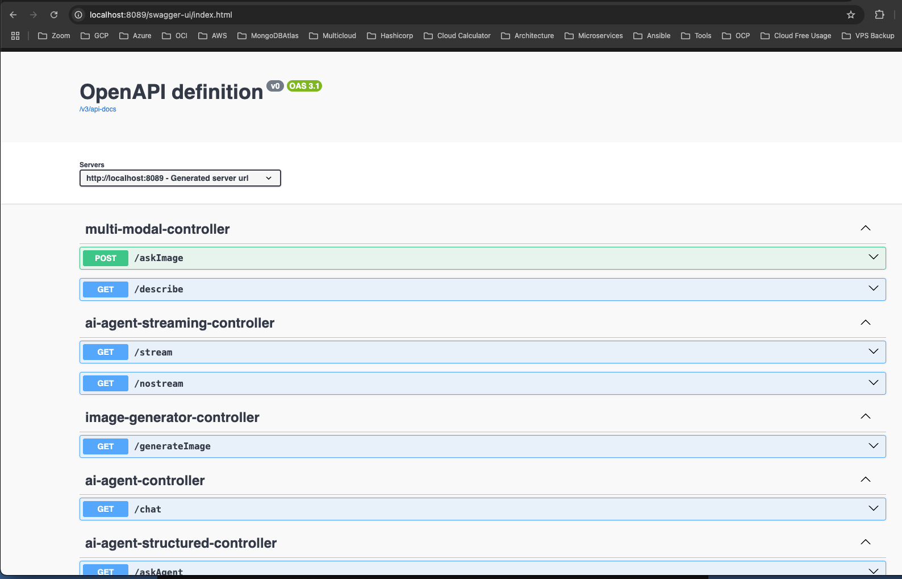

# Spring AI Agentic AI

- Swagger: http://localhost:8089/swagger-ui/index.html

- Upload image and as question about

- Describe image and transform output

- Stream Response Output

- Generate Image

- AI Agent structured output

